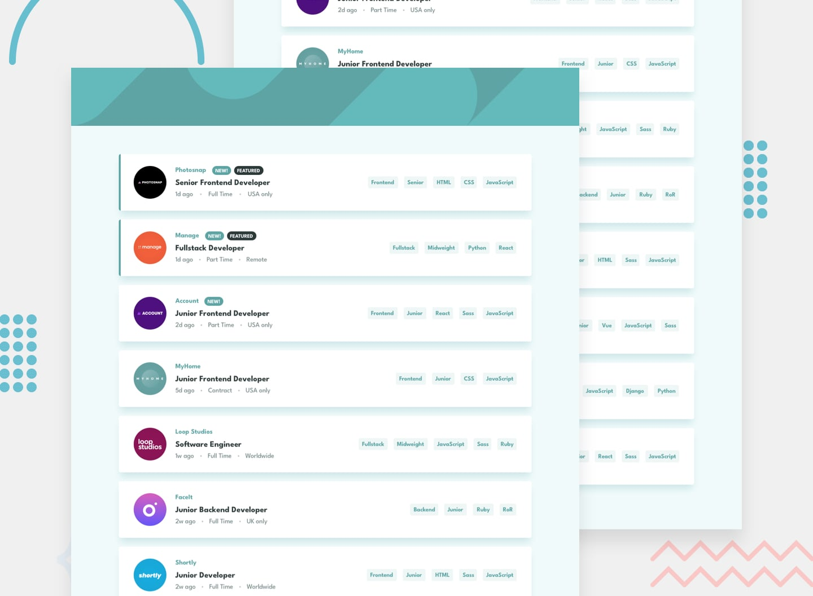

# 💼 Static Job Listings with Dynamic Filtering

> A modern, responsive job board featuring real-time tag-based filtering built with **TypeScript**, **Tailwind CSS**, and pure DOM manipulation.

[](https://www.typescriptlang.org/)
[](https://tailwindcss.com/)
[](https://vitejs.dev/)

---

## 📸 Preview

<div align="center">
  
</div>

---

## ✨ Key Features

- **🎯 Precision Multi-Filter Logic:** Filters job cards using **AND logic**—only jobs matching _all_ selected tags are displayed.
- **🛡️ Clean DOM State Management:** Extracted text nodes explicitly target badge elements, avoiding whitespace pollution and false matches.
- **⚡ Reactive Tag Removal:** Dynamic event listeners ensure instant re-filtering when individual filter tags or all filters are removed.
- **🚫 Duplicate Prevention:** Prevents users from adding redundant filter pills to the active filter bar.
- **📱 Fully Responsive:** Clean layout tailored for both desktop and mobile viewports using **Tailwind CSS**.

---

## 🛠️ Tech Stack & Concepts Covered

- **Language:** TypeScript
- **Styling:** Tailwind CSS
- **Bundler:** Vite
- **DOM Concepts:** Event delegation, event bubbling prevention (`stopPropagation`), dynamic node creation, `Array.prototype.every()` state evaluation.

---

## 💡 How It Works

<details>
<summary><b>🔍 View Core Filtering Logic (TypeScript)</b></summary>

```typescript
function filterJobs() {
  // Extract clean text from selected active filter badges
  const activeFilters = Array.from(innerDiv.querySelectorAll("button"))
    .map((btn) => btn.querySelector("span")?.textContent?.trim() || "")
    .filter(Boolean);

  // Evaluate each job card against ALL active filters (AND Logic)
  jobListings.forEach((job) => {
    const jobTags = Array.from(job.querySelectorAll("button")).map(
      (btn) => btn.textContent?.trim() || "",
    );

    const isMatching = activeFilters.every((filter) =>
      jobTags.includes(filter),
    );

    if (isMatching || activeFilters.length === 0) {
      job.classList.remove("hidden");
    } else {
      job.classList.add("hidden");
    }
  });
}
```
